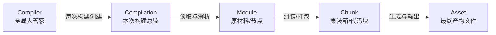

# Webpack 核心对象与管线概览

## 📍 定位：全管线概览 — 从源码到产物的生命周期

## 🔭 情境 (Context)

打开 `examples/commonjs/`，你会发现入口文件 `example.js` 引入了 `increment.js`，而 `increment.js` 又引入了 `math.js`。
仅仅是这样简单的三个文件互相调用，Webpack 处理它们时却不会仅仅做个简单的“字符串拼接”。
构建后，你会在产物（bundle）里看到这三个文件被套在了一个大对象（`__webpack_modules__`）里，并在浏览器中通过 Webpack 自身实现的一套 `__webpack_require__` 方法来运行。

为什么原本在硬盘里松散的“文件”，到了 Webpack 手里能变成被任意揉捏、封装的模块集合？

## 🧠 概念图式 (Schema)

这得益于 Webpack 内部高度抽象的“流水线模型”。在整条流水线上，有 **5 个极其关键的核心对象** 贯穿始终。

**核心心智：Webpack = 图构建器 + 生命周期调度器 + 代码生成器**



**用工厂流水线做类比：**

1. **`Compiler`**：汽车厂的 **CEO**。生命周期极长，负责启动工厂、加载基础配置（`webpack.config.js`）并注册所有内置与外置插件。
2. **`Compilation`**：今天这一批次生产的 **厂长**。负责单次（或增量热更新时）的具体构建流程。只要代码改动触发了重新编译，CEO 就会任命一位新的厂长。
3. **`Module`**：汽车的 **零部件**。从硬盘读出的 `.js`、`.css`，在 Webpack 眼里都是独立的对象，它们通过依赖关系连接形成 **ModuleGraph**（骨架图纸）。
4. **`Chunk`**：把零部件拼装好的 **“半成品/集装箱”**。比如按照入口点（Entry），或者通过 Code Splitting 规则切割出来的代码块，构成 **ChunkGraph**。
5. **`Asset`**：最终可以出厂销售的 **整车产品**（即将写入硬盘的 `bundle.js` 文件字符串及元数据）。

## 📖 源码导读 (Source)

这 5 个核心对象在 Webpack 源码里是真实存在的独立庞大类（位于 `lib/` 目录下）。我们来看生命周期是如何驱动它们的流转的：

**1. 从 Compiler 诞生 Compilation：**

```javascript
// lib/Compiler.js (核心启动过程)
class Compiler {
	compile(callback) {
		const params = this.newCompilationParams();
		// 触发编译前钩子
		this.hooks.beforeCompile.callAsync(params, err => {
			// 每次编译，创建一个全新的 Compilation 实例上下文
			const compilation = this.newCompilation(params);
			// 触发 make 钩子，正式进入构建图（ModuleGraph）阶段
			this.hooks.make.callAsync(compilation, err => { ... });
		});
	}
}
```

**2. Compilation 在 SEAL 阶段将 Module 装箱进 Chunk，并生成 Asset：**

```javascript
// lib/Compilation.js (核心封装过程)
class Compilation {
	seal(callback) {
		this.hooks.seal.call();
		// 1. 图转化：根据之前的 ModuleGraph 构建 ChunkGraph（将小模块塞进大集装箱）
		buildChunkGraph(this, chunkGraphInit);

		// 2. 优化：通知各个插件对 Chunk 进行优化 (如 SplitChunks, Tree Shaking 的清除)
		this.hooks.optimizeChunks.call(this.chunks, this.chunkGroups);

		// 3. 代码生成：把包含了很多 Module 的 Chunk 生成最终要写文件的代码字符串 (Asset)
		this.createChunkAssets();
	}
}
```

## 🧪 实验验证 (Experiment)

在这个源码仓库中，你可以这样验证这个流程：

1. **观察构建产物**
   查看 `examples/commonjs/README.md`，它完整展示了 `example.js` 和 `math.js` 在经历 `Module -> Chunk -> Asset` 转化后，最终的 `bundle.js` 长什么样。你会看到每个文件（Module）是如何被包裹在 `eval()` 或函数体中的。

2. **在源码里下探针**
   在 `lib/Compilation.js` 的 `seal` 方法内部（大约 2800 行左右，`this.hooks.optimizeChunks.call` 的前后），你可以加一句：
   ```javascript
   console.log(
   	"当前模块数量:",
   	this.modules.size,
   	" | Chunk 数量:",
   	this.chunks.size
   );
   ```
   然后运行针对 CommonJS 的测试：
   ```bash
   yarn test:basic -- --testPathPatterns="ConfigTestCases" --testNamePattern="commonjs"
   ```
   你能直观地在终端看到，Webpack 在这一阶段拥有多少个零件（Module），最终装了几个箱（Chunk）。
