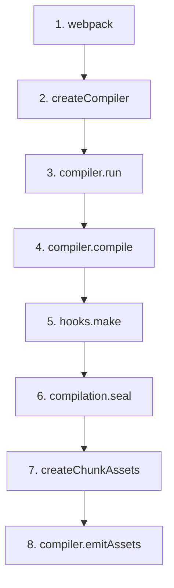

# 主流程源码精读 — 从 `webpack()` 到产出文件

## 📍 定位：全管线（Phase 1 ~ Phase 4）

## 🔭 情境 (Context)

当我们在终端敲下 `webpack` 命令，或者在 Node.js 代码里写下：

```javascript
const webpack = require("webpack");
const compiler = webpack({ ...配置对象 });
compiler.run((err, stats) => { ... });
```

从这一行 `webpack()` 调用开始，到底层产生 `bundle.js`，这中间经过了哪些核心源码文件的流转？
如果你想要自己写 Plugin，就必须摸透这套生命周期。

## 🧠 概念图式 (Schema)

通过追踪源码主干，我们会发现一条极度清晰的函数调用链：



**设计取舍**：
Webpack 为什么要把构建过程切分得这么细，还搞出这么多 `hooks`（钩子）？
因为 Webpack 团队想把自己也当成“第三方开发者”。Webpack 内核只保留这套骨架，其所有特性（如 Tree Shaking、Code Splitting、Terser 压缩）全部都是通过监听 `hooks` 的内置 Plugin 来实现的。骨架越干净，生态扩展能力就越强。

## 📖 源码导读 (Source)

我们按照执行顺序，精读 Webpack 核心路径上的 3 个关键文件：

### 1. 厂长上任：`lib/webpack.js`

入口函数 `webpack(options)` 内部调用了 `createCompiler`。

```javascript
// lib/webpack.js
const createCompiler = (rawOptions, compilerIndex) => {
	let options = getNormalizedWebpackOptions(rawOptions);

	// 1. 创建 Compiler 实例（全生命周期大管家）
	const compiler = new Compiler(options.context, options);

	// 2. 挂载用户配置在 webpack.config.js 里的 plugins
	if (Array.isArray(options.plugins)) {
		for (const plugin of options.plugins) {
			plugin.apply(compiler);
		}
	}

	// 3. 挂载 Webpack 几百个内置的 Plugin
	new WebpackOptionsApply().process(options, compiler);

	return compiler;
};
```

### 2. 启动产线：`lib/Compiler.js`

当你调用 `compiler.run()` 时，正式启动构建流。

```javascript
// lib/Compiler.js
class Compiler {
	run(callback) {
		const onCompiled = (err, compilation) => {
			// EMIT 阶段：当编译完成，准备把内存里的 Asset 写入硬盘
			this.emitAssets(compilation, err => {
				this.hooks.done.callAsync(stats, ...);
			});
		};
		// 进入编译逻辑
		this.compile(onCompiled);
	}

	compile(callback) {
		// INIT: 创建单次构建上下文 Compilation 实例
		const compilation = this.newCompilation(params);

		// MAKE 阶段开始：广播 make 钩子，EntryPlugin 会监听到并开始解析入口文件
		this.hooks.make.callAsync(compilation, err => {
			// SEAL 阶段开始：模块图建好了，开始封装与优化
			compilation.seal(err => {
				// 完成后回调上方的 onCompiled
				this.hooks.afterCompile.callAsync(compilation, err => {
					return callback(null, compilation);
				});
			});
		});
	}
}
```

### 3. 加工打包：`lib/Compilation.js`

这是整个架构中最长的一段逻辑，`seal` 方法涵盖了图优化、分包、代码生成的全过程。

```javascript
// lib/Compilation.js
class Compilation {
	seal(callback) {
		this.hooks.seal.call(); // 冻结 ModuleGraph 模块图

		// 1. 优化依赖 (FlagDependencyUsagePlugin 在这里发力，做 Tree Shaking 标记)
		while (this.hooks.optimizeDependencies.call(this.modules)) {}

		// 2. 构建 ChunkGraph (将独立的 module 连入 chunk 集装箱)
		buildChunkGraph(this, chunkGraphInit);

		// 3. 优化 Chunk (SplitChunksPlugin 在这里发力，进行分包拆片)
		while (this.hooks.optimizeChunks.call(this.chunks, this.chunkGroups)) {}

		// 4. 代码生成 (让每个模块把自己变成字符串)
		this.codeGeneration((err) => {
			// 5. 生成 Chunk Assets (把装好 module 字符串的 chunk，转成准备写盘的最终 Asset 对象)
			this.createChunkAssets((err) => {
				// EMIT 前最后的拦截点 (BannerPlugin 等对产物加版权注释的插件在这里执行)
				this.hooks.processAssets.callAsync(this.assets, (err) => {
					callback();
				});
			});
		});
	}
}
```

## 🧪 实验验证 (Experiment)

你可以通过给源码加 `console.log` 来验证这个流转。

1. 打开 `lib/Compiler.js` 的 `run` 方法（~504 行处），加一行 `console.log("==> Compiler.run 启动！");`
2. 打开 `lib/Compilation.js` 的 `seal` 方法（~3183 行处），加一行 `console.log("==> 进入 Compilation.seal！当前模块数:", this.modules.size, "Chunk数:", this.chunks.size);`
3. 运行基础的打包用例：
   ```bash
   yarn test:basic -- --testPathPatterns="ConfigTestCases" --testNamePattern="commonjs"
   ```
4. 观察终端输出的执行顺序。
