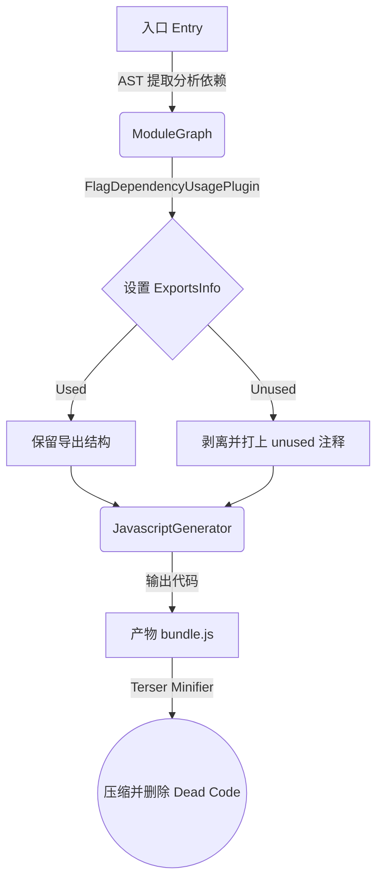

## 📍 定位：Phase 3: SEAL阶段（优化与代码生成） — 剔除未使用的导出 (Dead Code Elimination)

## 🔭 情境 (Context)
打开 `examples/harmony-unused/`，入口 `example.js` 里写了：

```javascript
import { add } from './math';
import * as library from "./library";

add(1, 2);
library.reexportedMultiply(1, 2);
```

而在对应的 `math.js` 内部，实际上导出了三个函数：`add`, `multiply`, `list`。

当你在生产模式（Production Mode）由于默认开启了 Tree Shaking 构建 Webpack 项目后，查看产出的 chunk 代码时，你会发现代码中**只有 `add` 函数的实现**，而 `multiply` 和 `list` 两个函数就像是被“摇落的枯叶”一样，消失得无影无踪。

那么，Webpack 如何知道哪些函数该留下，哪些可以扔掉？这就是 Tree Shaking 机制。

## 🧠 概念图式 (Schema)
在 Webpack 中，Tree Shaking 本质上是一个“标记 - 清扫（Mark-and-Sweep）”的结合过程：



1. **Mark (标记未被使用)**：Webpack 在 **SEAL 阶段**（优化模块图时）从入口出发，追踪所有的依赖树。利用 `FlagDependencyUsagePlugin` 给每个模块里面的 `ExportsInfo`（导出信息）打上使用标记。
2. **Sweep (代码生成清扫)**：在代码生成环节（CodeGen），未被使用的导出并不会被放入 `__webpack_exports__` 中，取而代之的是输出一条 `/* unused harmony export xxx */` 的隐蔽注释。
3. **Dead Code Elimination (真正的抹除)**：因为未使用的函数没有任何出口挂载点，它们变成了独立的“死代码（闭包内的无副作用变量）”。这时候 Terser 等代码压缩工具登场，将这部分安全又无用的代码彻底抹除。

> **核心设计取舍**：Webpack 的任务只是精准执行“数据流与图结构的状态标记 + 代码结构解绑”，并不负责直接进行正则替换删除文字，真正的代码剔除任务转交给了专做 AST 处理的 Minifier (Terser)，实现各司其职。

## 📖 源码导读 (Source)

1. **`lib/FlagDependencyUsagePlugin.js`** — 追踪标记使用的核心器：
   - **Tap点**：`compilation.hooks.optimizeDependencies.tap`
   - **核心职责**：通过内部的 `processReferencedModule` 函数，从顶级遍历并在 `exportsInfo.setUsedConditionally` 中追踪并改变状态，它会判断一个导出是 `UsageState.Used` 还是 `UsageState.Unused`。

2. **`lib/dependencies/HarmonyExportInitFragment.js`** — 负责生成 Harmony（ESM）模块导出代码：
   - 其中的 `getContent` 方法处理着我们最终产物的代码字符串拼接。
   - 当遇到未使用的导出（`this.unusedExports` 列表有内容）时，它只会生成注释而跳过生成：
   ```javascript
   // 片段示例 (HarmonyExportInitFragment.js):
   const unusedPart =
     this.unusedExports.size > 1
       ? `/* unused harmony exports ${joinIterableWithComma(this.unusedExports)} */\n`
       : this.unusedExports.size > 0
         ? `/* unused harmony export ${first(this.unusedExports)} */\n`
         : "";
   ```

3. **`lib/optimize/SideEffectsFlagPlugin.js`**
   - 除了未被使用的导出能通过上述方式干掉。如果一个包在其 `package.json` 中配置了 `"sideEffects": false`，这个插件会更激进地标记没有调用的整块模块，整片拔起而不做编译。

## 🧪 实验验证 (Experiment)

你可以直接跑 Webpack 本仓库里用来测试和体验 Tree Shaking 的官方例子，亲自观察这一过程：

**第一层：跑 ConfigCase 测试（验证插件生效）**
```bash
yarn test:basic -- --testPathPatterns="ConfigTestCases" --testNamePattern="side-effects"
```

**第二层：观察官方 Example 产物差异**
我们可以通过编译 `examples/harmony-unused/` 看未配置压缩时，Webpack 给加上的 unused 注释是怎么样的：
```bash
# 建议通过命令行直接运行，对比产物差异：
node ./bin/webpack.js --mode development --config examples/harmony-unused/webpack.config.js
```
*（提示：Development 模式下并不会删除死代码，你可以在其最终生成的物理文件或缓存文件中，清晰地找到 Webpack 留下的 `/* unused harmony export */` 神秘标记。）*
