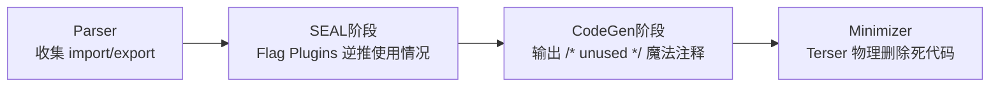

# Tree Shaking 原理

## 📍 定位：SEAL 阶段 — 标记模块导出使用情况，并在代码生成时剔除未使用代码

## 🔭 情境 (Context)

观察官方示例 `examples/harmony-unused/`：
在 `math.js` 中，我们导出了三个函数：

```javascript
export function add() { ... }
export function multiply() { ... }
export function list() { ... }
```

而在 `example.js` 中，我们仅仅引入并使用了 `add`：

```javascript
import { add } from "./math";
add(1, 2);
```

构建后，最终生成的产物里不再包含 `multiply` 和 `list`。一个 `import` 是如何让 Webpack 判定其他函数属于“死代码”的？

## 🧠 概念图式 (Schema)

Tree Shaking 并不是一个单一的动作，而是一套跨越多个管线阶段的**“静态标记 + 死代码擦除”**组合拳。Webpack 自身实际上**并不物理删除代码**，它只负责收集情报和打标记，真正的删除交由下游的 Minimizer（如 Terser）完成。



**设计取舍**：
Tree Shaking 能够工作，强依赖于 ESM (ECMAScript Modules) 语法的**静态特性**（即你不能在 `if` 语句里 `import`，导出的名字也是固定的）。一旦代码中出现 CommonJS 的动态 `require` 或无法静态分析的属性访问，Webpack 出于“安全优先”的原则，就会放弃剪枝，避免破坏业务逻辑。

## 📖 源码导读 (Source)

Tree Shaking 依赖以下核心机制完成情报收集和代码生成：

1. **依赖收集与标记** (`lib/FlagDependencyUsagePlugin.js`):
   在 `compilation.hooks.optimizeDependencies` 钩子中，Webpack 根据入口文件遍历 `ModuleGraph`，逆向推导每个导出 (Export) 是否被实际使用。

2. **代码生成时阻断** (`lib/dependencies/HarmonyExportInitFragment.js`):
   当 Webpack 将 AST 转换回最终要输出的 JavaScript 字符串时，对于被标记为未使用的导出，它会故意**不**生成将其挂载到 `exports` 对象上的代码，而是生成一段 `/* unused harmony export */` 注释。

   ```javascript
   // lib/dependencies/HarmonyExportInitFragment.js 核心片段
   const unusedPart =
   	this.unusedExports.size > 1
   		? `/* unused harmony exports ${joinIterableWithComma(this.unusedExports)} */\n`
   		: this.unusedExports.size > 0
   			? `/* unused harmony export ${first(this.unusedExports)} */\n`
   			: "";
   return `${definePart}${unusedPart}`;
   ```

Terser 等压缩工具在处理最终的 JS 代码时，发现声明的局部变量或函数没有被任何 `exports` 引用（成为了孤立的无副作用死代码），就会将其彻底删除。

## 🧪 实验验证 (Experiment)

你可以通过以下命令在本项目中验证 Tree Shaking 的行为：

1. **运行专属测试用例**：

   ```bash
   yarn test:basic -- --testPathPatterns="StatsTestCases" --testNamePattern="tree-shaking"
   ```

2. **观察特定示例的构建产物**：
   查看 `examples/harmony-unused/` 的源码：
   ```bash
   cat examples/harmony-unused/example.js
   cat examples/harmony-unused/math.js
   ```
