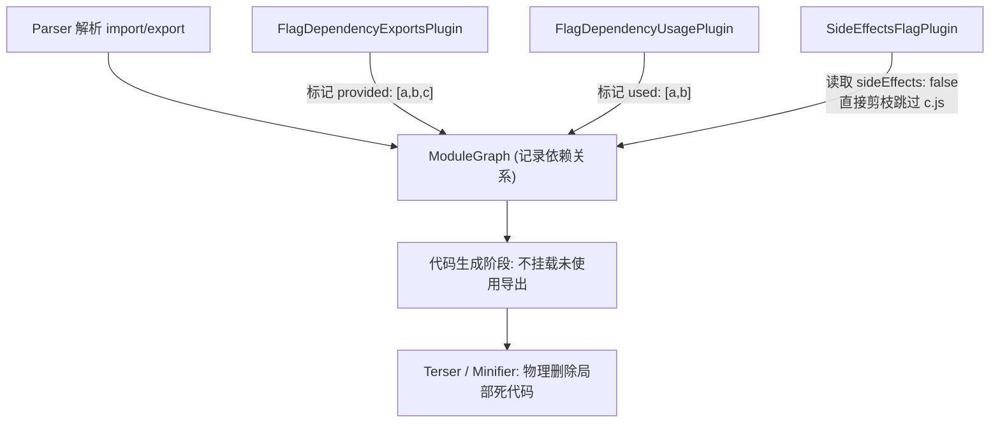

# Tree Shaking 原理（Webpack）

**主题**：Tree Shaking 在 Webpack 里如何工作？与「摇树」比喻对应的真实管线是什么？

## 📍 在架构中的位置

Tree Shaking 横跨 **第 4 层（模块图 Module Graph）** 与 **第 5 层（Chunk / 代码生成）**，并在 **产物压缩** 阶段收尾。Webpack 的核心职责是**静态标记**（提供了什么、用到了什么）与**结构生成**，真正的「物理删代码」交由下游的 Minifier（如 Terser）完成。

## 👁️ 现象与实践 (Phenomenon)

如果你打开本仓库的官方示例 `examples/side-effects`，会看到一段特别典型的 Tree Shaking 现象。
在入口代码 (`example.js`) 中，开发者同时引入了两个库的局部变量：

```javascript
import { a as a1, b as b1 } from "big-module";
import { a as a2, b as b2 } from "big-module-with-flag";
```

这两个库内部都有 `a.js`, `b.js`, `c.js`。构建后肉眼可见的差异是：

1. `big-module` 没有做特殊声明，构建后它的 `a.js`, `b.js`, `c.js` **全被打包**进去了。
2. `big-module-with-flag` 的 `package.json` 加了一句 `"sideEffects": false`，构建后产物里**完全砍掉了未使用的 `c.js`**。

**现象本质**：Webpack 知道你只用了 `a` 和 `b`。但对于没有副作用保证的库，Webpack 不敢轻易抛弃 `c`（万一 `c` 里面偷偷改了全局变量呢？）。只有开发者用 `"sideEffects": false` 做出保证后，Webpack 才成功砍掉了整个没用到的子模块。

## 🧠 核心概念与数据流 (Theory & Data Flow)

结合上述现象，在 Webpack 管线内部发生了什么？

1. **Parser 建立依赖**：解析到 `import { a... }` 时，Webpack 内部生成 `HarmonyImportSpecifierDependency`。
2. **汇总提供导出 (`providedExports`)**：通过 `FlagDependencyExportsPlugin`，Webpack 在 `ModuleGraph` 的 `ExportsInfo` 上给 `big-module-with-flag` 挂上记录：它对外**提供**了 `[a, b, c]`。
3. **标记使用导出 (`usedExports`) & 评估副作用**：通过 `FlagDependencyUsagePlugin`，Webpack 从入口逆推，发现只**使用**了 `[a, b]`。配合 `SideEffectsFlagPlugin` 读取了 `"sideEffects": false` 标志，Webpack 决定把没用到的 `c` 整个从模块图中跳过（剪枝）。
4. **代码生成层**：当把 AST 转回代码时，对未使用的导出，Webpack 会插入类似 `/* unused harmony export c */` 的注释，并且**不**把它挂载到模块对外暴露的 `__webpack_exports__` 对象上。
5. **压缩消除 (Minify)**：Terser 接管最终生成的字符串，发现 `c` 成了毫无外部引用的局部死代码，直接将其彻底抹除。




**设计取舍**：Tree Shaking 强依赖 ESM 的静态特性。因为 CommonJS 允许动态 `require(varName)`，打包器无法在编译时 100% 确定到底导出了什么。此外，保留副作用兜底（除非显式声明 `sideEffects: false`）是 Webpack 安全优先的取舍，宁可打包体积大一点，也不能破坏原本的业务逻辑。

## 🛠 细节与实操 (Implementation)

**控制开关与配置项**（源码位于 `lib/config/defaults.js`）：

- `optimization.providedExports`：默认开启。
- `optimization.usedExports`：生产环境 (`production`) 默认开启。
- `optimization.sideEffects`：生产环境 (`production`) 默认开启。

**关键钩子映射**：

- `FlagDependencyExportsPlugin` 挂载在 `compilation.hooks.finishModules`（异步阶段）。
- `FlagDependencyUsagePlugin` 和 `SideEffectsFlagPlugin` 挂载在 `compilation.hooks.optimizeDependencies`（在 `Compilation.seal` 阶段同步执行）。
- `/* unused harmony export */` 这类魔法注释的代码生成，位于 `lib/dependencies/HarmonyExportInitFragment.js`。

**本地验证方式**：
可以通过开启构建配置中的 `stats` 相关选项，在构建日志中显式输出 `providedExports` 和 `usedExports` 字段。对照仓库中的 `examples/side-effects`，运行构建命令即可观测到上述完整的链路表现。