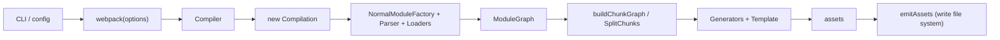

# 主题：Webpack 的架构设计和工作原理

原问题：帮我梳理 webpack 的架构设计和工作原理。

## 📍 在架构中的位置
这是一个跨越 Webpack 全管线的问题，覆盖六大核心分层：入口与 CLI、Compiler/Compilation、Tapable 生命周期、模块图、Chunk 图与代码生成、最终输出。

它的上游是用户配置与命令行输入，下游是产物文件（assets）及其运行时加载行为。

## 🧠 核心概念与设计意图
Webpack 的核心设计目标不是“把文件压缩一下”，而是把前端工程抽象成一张可计算的依赖图，然后在“可扩展生命周期”上执行转换、优化和输出。

- **统一抽象**：所有资源最终都被视作 `Module`，用 `ModuleGraph` 维护关系。
- **可扩展机制**：通过 Tapable hooks 把核心流程开放给插件。
- **分层解耦**：解析与建图（Module Graph）和分块与生成（Chunk Graph）分离，便于按需优化。
- **增量与长期演进**：`Compiler` 管全局生命周期，`Compilation` 管单次构建，支持 watch、cache、HMR 等模式。

## 🛠 细节与实操（源码位置/示例）
### 1) 入口与 CLI（Init）
- 设计意图：把用户输入（CLI 参数 + 配置文件）标准化为可执行的构建选项。
- 关键源码：
  - `lib/webpack.js`：入口工厂，创建 `Compiler`。
  - `lib/config/`：配置默认值、归一化与处理。
  - `schemas/`：配置合法性约束（JSON Schema）。

### 2) Compiler / Compilation（Core Object）
- 设计意图：区分“长生命周期控制器”和“单次构建上下文”。
- 关键源码：
  - `lib/Compiler.js`：组织构建流程、调度 hooks、最终输出。
  - `lib/Compilation.js`：承载本次构建的 modules/chunks/assets。

### 3) Tapable 生命周期（Plugin System）
- 设计意图：核心流程可插拔，允许生态在不同阶段扩展行为。
- 关键点：
  - 插件通过 `compiler.hooks.*`、`compilation.hooks.*` 注入逻辑。
  - 常见钩子示例：`make`、`seal`、`processAssets`、`emit`。

### 4) 模块图（Module Graph）
- 设计意图：把“文件集合”升级为“依赖关系图”，让优化建立在图算法上。
- 关键流程：
  1. `resolve` 找到模块真实路径。
  2. Loader 链转换源码。
  3. Parser 解析 AST，收集 `import/require` 依赖。
  4. 递归构建 `ModuleGraph`。
- 关键源码：
  - `lib/NormalModuleFactory.js`、`lib/NormalModule.js`
  - `lib/Parser.js`、`lib/javascript/JavascriptParser.js`
  - `lib/ModuleGraph.js`

### 5) Chunk 图与代码生成（Chunk Graph）
- 设计意图：将“依赖关系”映射成“可加载单元”，服务于按需加载与缓存策略。
- 关键流程：
  - `buildChunkGraph` 决定模块进哪些 chunk。
  - `SplitChunksPlugin` 做公共依赖切分。
  - Generators + `Template` 生成最终运行时代码与模块包装代码。
- 关键源码：
  - `lib/buildChunkGraph.js`
  - `lib/optimize/SplitChunksPlugin.js`
  - `lib/ChunkGraph.js`
  - `lib/Template.js` 与各类 `*Generator.js`

### 6) 输出（Emit）
- 设计意图：把内存中的 `assets` 统一落盘，并在此阶段允许最后加工。
- 关键源码：
  - `lib/Compiler.js` 中的 `emitAssets` 及相关 `emit` 生命周期。

### 最小心智模型（建议记忆）
“Webpack = 图构建器 + 生命周期调度器 + 代码生成器”

当你读任何配置时，都可以问三件事：
1. 它影响的是 **建图**（Module Graph）还是 **分块**（Chunk Graph）？
2. 它发生在生命周期的哪个钩子阶段？
3. 它改变的是输入源码、图结构，还是最终 assets？
