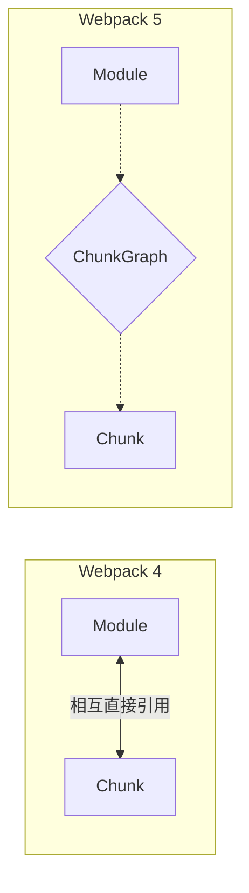

# Webpack 4 vs Webpack 5 主流程核心差异

## 📍 定位：架构演进 — 解决内存泄漏、提升缓存性能的底层重构

## 🔭 情境 (Context)

如果你曾经经历过从 Webpack 4 升级到 5，或者看过别人写的旧版 Plugin 教程，你大概率会遇到两个现象：
1. **Plugin 疯狂报错**：以前在 Webpack 4 里能跑的代码，在 5 里报 `module.addChunk is not a function` 或 `chunk.modulesIterable is undefined`。
2. **构建速度的神奇飞跃**：在没有配置任何 `cache-loader` 的情况下，只要在配置里加一句 `cache: { type: 'filesystem' }`，二次构建速度能快好几倍。

这两个现象的背后，正是 Webpack 5 对主流程进行的**三大底层重构**。

## 🧠 概念图式 (Schema)

Webpack 5 的整体 5 个阶段（INIT -> MAKE -> SEAL -> EMIT -> WATCH）并没有变，但在**数据流向**和**对象职责**上做了大手术。

### 差异 1：图数据结构的剥离（破除“蜘蛛网”对象）

* **Webpack 4（蜘蛛网模型）**：
  在 Wp4 的 SEAL 阶段，`Module` 身上直接挂着 `this.chunks`（包含我的 Chunk 有哪些），`Chunk` 身上直接挂着 `this.modules`（我包含了哪些 Module）。
  **后果**：严重的**循环引用**。内存很容易泄漏，Node.js 的垃圾回收（GC）压力极大；更致命的是，包含循环引用的对象**无法被轻易序列化存入硬盘**。
  
* **Webpack 5（引入 Graph 概念）**：
  把连线工作外包了！新增了你在上一个问题中提到的 **`ModuleGraph`** 和 **`ChunkGraph`**。
  `Module` 和 `Chunk` 变成了纯粹的“节点数据结构”，它们不知道彼此的存在。所有的“谁包含谁”、“谁依赖谁”的连线，全部由 `ModuleGraph` 和 `ChunkGraph` 集中管理。
  **优势**：解开了循环引用，使得大对象可以被序列化，为“持久化缓存”铺平了道路。



### 差异 2：代码生成阶段（Code Generation）的独立

* **Webpack 4**：
  在生成最终文件时，每次都是调用模块内部的 `module.source()`，在把模块塞进 Chunk 的时候顺便把代码字符串算出来。
* **Webpack 5**：
  在 SEAL 阶段专门切出了一个独立的 `this.codeGeneration()` 步骤。
  **优势**：一个模块的原始代码（AST 到 String 的转化）只计算一次，算完就把这段**代码片段缓存起来**。后面不管这个模块被分配到几个不同的 Chunk 里，都可以直接复用这段生成的代码片段，大幅降低 CPU 开销。

### 差异 3：原生下场做“持久化缓存”（Persistent Caching）

* **Webpack 4**：
  只能靠社区工具“外挂”缓存，比如 `cache-loader`（缓存 loader 结果）、`hard-source-webpack-plugin`（勉强缓存整个项目，但经常出 Bug）。
* **Webpack 5**：
  官方打通了全管线。在 MAKE 阶段和 SEAL 阶段，Webpack 5 不仅缓存文件内容，还把整个 `ModuleGraph` 和生成好的代码片段（Code Generation）直接序列化存进本地文件系统（`.cache/webpack`）。

## 📖 源码导读 (Source)

如果你去翻看 Webpack 5 的源码，这些差异体现在：

1. **统一管理关系** (`lib/ModuleGraph.js` & `lib/ChunkGraph.js`)：
   提供了如 `chunkGraph.getChunkModulesIterable(chunk)` 和 `moduleGraph.getIssuer(module)` 的 API。代替了旧版的直接属性访问。
2. **独立的缓存包** (`lib/cache/`)：
   在 Webpack 5 源码中新增了一大片 cache 相关的插件（如 `MemoryWithGcCachePlugin`, `PackFileCacheStrategy`），它们深入在 Compilation 流水线的各个环节。
3. **隔离代码生成** (`lib/Compilation.js` 约 3448 行)：
   专门有一个 `this.codeGeneration` 函数。

## 🧪 实验验证 (Experiment)

在这个源码仓库的测试用例中，可以这样体验 Webpack 5 的缓存威力：

1. **运行一次带文件系统缓存的测试用例**：
   ```bash
   yarn test:basic -- --testPathPatterns="ConfigTestCases" --testNamePattern="cache-filesystem"
   ```
2. 这个测试会在临时目录中生成缓存文件。Webpack 5 能够证明，第二次运行时，它不仅跳过了 Loader 的执行，甚至跳过了大部分的 AST 解析和依赖图重建，直接从 `PackFileCacheStrategy` 中反序列化出了整个图结构。
