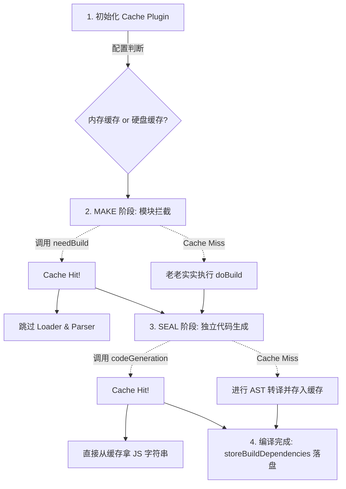

# 源码级：Webpack 5 缓存机制流转追踪

## 📍 定位：全管线缓存 — 从 `Module` 解析到硬盘序列化

## 🔭 情境 (Context)

上一节我们用快餐店的例子理解了 Webpack 5 如何通过缓存提速。但是作为工程师，我们想看到具体的代码逻辑。
Webpack 5 的“持久化缓存”到底在代码里是长什么样的？它是如何跳过 AST 解析（Loaders）和代码生成（CodeGen）的？这些东西最后又是怎么写到硬盘上的？

## 🧠 概念图式 (Schema)

在 Webpack 5 中，缓存系统无处不在。核心对象都有自己的缓存命名空间，比如 `compilation.getCache("NormalModule")` 或者 `compilation.getCache("Compilation/codeGeneration")`。

我们可以追踪 4 个核心的源码拦截点：



## 📖 源码导读 (Source)

### 1. Cache Plugin 拦截启动 (`lib/WebpackOptionsApply.js`)

在 Webpack 启动时，根据你配置的 `cache.type`，会加载不同的 Cache Plugin：

- 内存模式：`MemoryCachePlugin`
- 文件系统模式：`IdleFileCachePlugin` + `MemoryWithGcCachePlugin`

### 2. 拦截 `Module` 的构建，跳过 Loader (`lib/NormalModule.js`)

在 MAKE 阶段，管线试图构建每一个具体的 `NormalModule`。在真正去调 `loader-runner` 和 `acorn` 之前，会先去问 Cache：

```javascript
// lib/NormalModule.js 的 needBuild 方法
needBuild(context, callback) {
    const { fileSystemInfo } = context;
    const { cacheable, snapshot } = this.buildInfo;

    // 1. 如果这个模块不可缓存，老实重构
    if (!cacheable) return callback(null, true);
    // 2. 检查快照 (Snapshot) 判断文件自上次起是否被修改
    fileSystemInfo.checkSnapshotValid(snapshot, (err, valid) => {
        if (!valid) return callback(null, true); // 被改过，需要 build

        // 【核心】文件没被改过，直接跳过构建！不用走 Loader，不用生成 AST！
        callback(null, false);
    });
}
```

然后在 `Compilation.js` 的 `_buildModule` 逻辑中，如果 `needBuild` 拿到 `false`，它就直接 `return callback()`，整个巨耗时的构建过程被瞬间闪避了。

### 3. 独立的代码生成缓存 (`lib/Compilation.js`)

即使前面的 Module 解析跳过了，到了代码生成阶段，Webpack 依然要检查缓存，因为生成代码不仅与 Module 自身相关，还与依赖环境相关。

```javascript
// lib/Compilation.js 约 3753 行 _codeGenerationModule
_codeGenerationModule(module, runtime, results) {
    // 专门获取代码生成的专属缓存区
    const cacheItem = this._codeGenerationCache.getItemCache(
        `${module.identifier()}|${hash}`,
        null
    );

    // 尝试从缓存中获取已生成的字符串片段
    cacheItem.get((err, cachedResult) => {
        if (cachedResult) {
            // 【Cache Hit】直接复用缓存里的 JavaScript 字符串和 SourceMap
            result = cachedResult;
        } else {
            // 【Cache Miss】老老实实执行代码生成
            result = module.codeGeneration({...});
            // 生成完之后，存进 CacheItem
            cacheItem.store(result, err => {...});
        }
    });
}
```

### 4. 最终落盘 (`lib/Compiler.js`)

我们在前三步看到的都是向抽象的 Cache API 存取数据。这些数据什么时候写到硬盘里呢？
Webpack 5 非常聪明，为了不阻塞构建，它会等待整个打包过程完全结束后才进行落盘。

```javascript
// lib/Compiler.js 约 603 行，在 done hook 回调之后
this.hooks.done.callAsync(stats, (err) => {
	// 触发全局写盘指令
	this.cache.storeBuildDependencies(compilation.buildDependencies, (err) => {
		// ... 打包彻底结束
	});
});
```

随后，底层的 `lib/cache/PackFileCacheStrategy.js` 会接管这些指令，把内存里庞大的 Module、Graph 和 CodeGen 结果，打包压缩成 `.pack` 格式二进制文件，静静地躺在你的 `.cache/webpack` 目录中。

## 🧪 实验验证 (Experiment)

在本项目（Webpack 源码仓库）中，你可以通过在核心断点添加日志来验证：

1. 打开 `lib/NormalModule.js` 大约 **1655 行**附近（在 `needBuild` 回调内部），加上：
   ```javascript
   console.log(`[Cache Check] 模块 ${this.rawRequest} 是否需要构建: ${!valid}`);
   ```
2. 打开 `lib/Compilation.js` 大约 **3769 行**附近（在 `_codeGenerationModule` 内部），加上：
   ```javascript
   console.log(
   	`[CodeGen] ${module.rawRequest} - ${cachedResult ? "命中缓存" : "生成新代码"}`
   );
   ```
3. 跑两次这个带 `cache: filesystem` 的测试用例（第一次写入缓存，第二次读取）：
   ```bash
   yarn test:basic -- --testPathPatterns="ConfigTestCases" --testNamePattern="cache-filesystem"
   ```

   - **第一次运行**：你会看到满屏的“需要构建: true”和“生成新代码”。
   - **第二次运行**：你会看到大量的“需要构建: false”和“命中缓存”，整个编译在瞬间完成。
