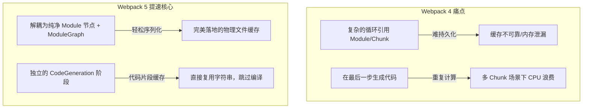

# Webpack 5 为什么比 Webpack 4 快这么多？

## 📍 定位：架构演进 — 性能提升背后的核心机制

## 🔭 情境 (Context)

很多开发者在将项目从 Webpack 4 升级到 5 之后，直观感受是：“太快了！” 特别是**二次构建（即修改代码后的重新构建或重启服务）**，速度往往有数量级的提升。

在 Webpack 4 时代，为了提速，我们要在 `webpack.config.js` 里堆砌各种魔法：

- 加 `cache-loader` 给各种 loader 增加缓存。
- 加 `babel-loader?cacheDirectory=true`。
- 加 `hard-source-webpack-plugin`（这个插件号称能给整个构建加速，但经常引起各种神秘的 Bug）。

而在 Webpack 5 中，只需要一行极其简单的配置：

```javascript
module.exports = {
	cache: { type: "filesystem" } // 开启物理文件缓存
};
```

就能打败上面所有的外部插件。为什么内置的这一行配置能这么快？

## 🧠 概念图式 (Schema)

Webpack 5 变快的根本原因在于它实现了真正的、贯穿全管线的**持久化缓存 (Persistent Caching)**。
为了让这个缓存能够安全、高效地工作，Webpack 5 在底层数据结构上做了两项巨大的重构：**图结构解耦**和**独立代码生成**。

我们可以把 Webpack 构建过程想象成一个**快餐流水线**：

1.  **点单 (Entry)**: 用户点单（入口文件）。
2.  **备菜 (MAKE 阶段: loaders + AST 解析)**: 把各种食材（源码）切配成可以炒的原料（AST，依赖关系）。
3.  **装盘配菜 (SEAL 阶段: ModuleGraph + Chunk)**: 厨师把配菜装进不同的盘子（确定哪些模块放在哪个 Chunk 里）。
4.  **炒菜出锅 (Code Generation / 代码生成)**: 实际下锅炒（把 AST 还原成要在浏览器里跑的 JS 字符串）。

### 为什么 Webpack 4 的缓存不管用（甚至经常出错）？

在 Webpack 4 里，这个流水线是**强耦合**的。

- **数据结构是一团乱麻（蜘蛛网问题）**：在 Wp4 里，菜（`Module`）和盘子（`Chunk`）是死死绑在一起的。模块里记录着它在哪个盘子里，盘子里也直接记录着它装了哪些模块。
  - _致命后果_：这种存在大量循环引用的对象，在编程语言层面是**极其难序列化**（也就是变成字符串存到硬盘上）的。第三方插件如 `hard-source-webpack-plugin` 试图强行把这坨乱麻存进硬盘，这就是为什么它经常出 Bug 崩溃的原因。
- **重复炒菜（代码生成晚）**：Wp4 里，只有在最后一步（出锅时），才会去把菜实际炒熟（根据 AST 生成最终 JS 字符串）。如果同一盘菜（模块）被分配到了两个不同的套餐（Chunk）里，厨师得把同样的动作做两遍。

### Webpack 5 是如何做到“秒出餐”的？

Webpack 5 的重构，就是为了让**整个流水线的每一步都可以被存进冰箱（硬盘），下次直接拿出来用**。

1.  **引入智能托盘（ModuleGraph & ChunkGraph 解耦）**：
    Webpack 5 不让菜（`Module`）和盘子（`Chunk`）直接认识了。它引入了一个全局账本（`ModuleGraph` 和 `ChunkGraph`）。
    菜只管自己是什么菜，账本记录哪盘菜放在哪个盘子里。
    - _提速点_：菜（模块）变得极其纯粹，没有了循环引用。Webpack 5 可以轻松地把每个解析好的模块、甚至这本全局账本，直接**序列化存入硬盘**。下次启动，直接反序列化读取，跳过所有 loader 和 AST 解析！

2.  **提前炒好半成品（Code Generation 阶段独立）**：
    Webpack 5 抽出了一步单独的“代码生成”阶段。菜切配好（AST 解析完）后，立刻把它炒熟（生成 JS 字符串），然后**放进冰箱缓存起来**。
    - _提速点_：以后不管这个模块要装进多少个不同的盘子（Chunk），或者你在改动其他文件时重新触发了构建，只要这个模块的代码没变，Webpack 5 就直接从缓存里把这串事先生成好的 JS 字符串拿出来用。这就叫**跳过代码生成 (Skip Code Generation)**，极大地节省了 CPU 时间。



## 📖 源码导读 (Source)

这套强大的缓存机制在源码中体现为一个复杂的体系：

1.  **缓存接管了一切** (`lib/cache/`)：
    Webpack 5 内部实现了多种缓存策略，例如 `PackFileCacheStrategy`。它负责把内存里的对象智能地分块（Pack）、序列化并写入 `.cache/webpack` 文件夹。
2.  **模块级别的缓存读写** (`lib/Compilation.js` 及其调用的各个插件)：
    在 `MAKE` 阶段构建模块时，如果有缓存，Webpack 会直接调取反序列化后的 `Module` 对象，跳过昂贵的 AST Parser 和 Loaders。
3.  **代码生成缓存** (`lib/Compilation.js` 约 3448 行的 `codeGeneration` 方法)：
    这里有一套严格的缓存判断机制。系统会检查模块对应的 `hash`，如果对得上，直接从内存/硬盘里抽取出代码片段，不再重复执行代码生成逻辑。

## 🧪 实验验证 (Experiment)

你可以通过对比来直观感受持久化缓存的威力。虽然我们无法在这里直接演示 Webpack 4，但你可以在这个 Webpack 5 源码库中体会缓存的工作：

运行测试用例（这个用例专门测试开启了 filesystem 缓存的情况）：

```bash
yarn test:basic -- --testPathPatterns="ConfigTestCases" --testNamePattern="cache-filesystem"
```

你可以观察到，测试会故意触发多次构建（模拟你修改代码后的热更新）。在第一次构建时，它需要老老实实走完所有流程；但在随后的构建中，如果你留心日志或用例断言，会发现系统直接从缓存中还原了整个模块图，速度极快。
